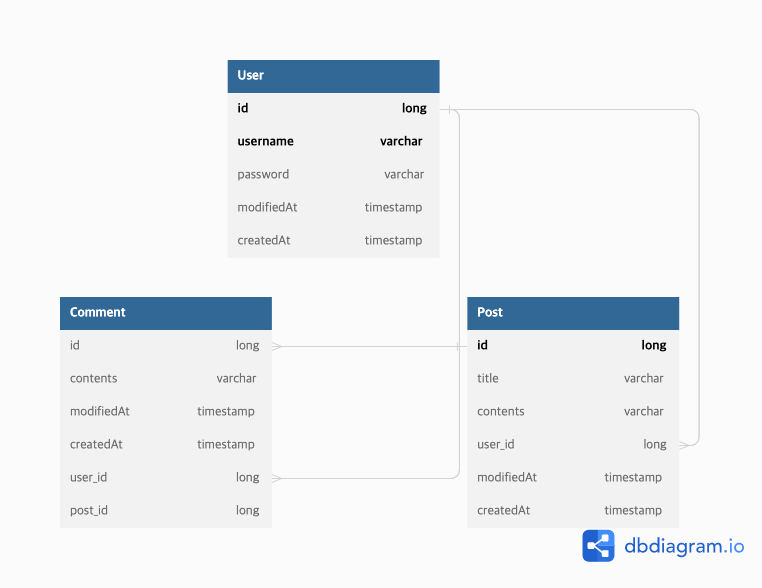

# 작은 스프링 API 제작프로젝트

## Use case
<p align="center"></p>

## ERD
<p align="center"></p>

## API 명세
`/api/posts`
<table>
<tr>
<td> Method </td>
<td> Description </td>
<td> Request </td>
<td> Response </td>
</tr>
<tr>
<td>GET</td>
<td>모든 게시물을 가져옵니다.</td>
<td>
    
 * **Header**
```
Authorization : Bearer {JWT}
``` 

 * **Payload**
```
-
```

</td>
<td>
<p style="color: greenyellow">200 OK</p>


    [{
        "id" : Long,
        "user" : { "id" : Long, "username" : String },
        "title" : String,
        "contents" : String,
        modifiedAt : LocalDateTime
    }, ...]

<p style="color: red">401 UNAUTHORIZED</p>

    {
        "status" : "Unauthorized",
        "message" : 인증 토큰이 유효하지 않습니다.
    }

</td>
</tr>
<tr>
<td>GET</td>
<td>하나의 게시물을 가져옵니다.</td>
<td>

* **Header**
```
Authorization : Bearer {JWT}
``` 

* **Payload**
```
pathvariable 
ex: /api/posts/{id}
```

</td>
<td>
<p style="color: greenyellow">200 OK</p>

    {
        "id" : Long,
        "title" : String,
        "contents" : String,
        modifiedAt : LocalDateTime
    }

<p style="color: red">401 UNAUTHORIZED</p>

    {
        "status" : "Unauthorized",
        "message" : 인증 토큰이 유효하지 않습니다.
    }

<p style="color: red">404 NOT FOUND</p>

    {
        "status" : "Not Found",
        "message" : 데이터를 찾을 수 없습니다.
    }

</td>
</tr>
<tr>
<td>POST</td>
<td>게시물을 등록합니다.</td>
<td>

* **Header**
```
Authorization : Bearer {JWT}
``` 

* **Payload**
```
Content-Type
application/json
{
    "title" : String,
    "contents" : String,
}
```

</td>
<td>
<p style="color: greenyellow">201 CREATED</p>

    {
        "id" : Long,
        "title" : String,
        "contents" : String,
        modifiedAt : LocalDateTime
    }

<p style="color: red">400 BAD REQUEST</p>

    {
        "status" : "Bad Request",
        "message" : {{reason of bad request}}
    }

<p style="color: red">401 UNAUTHORIZED</p>

    {
        "status" : "Unauthorized",
        "message" : 인증 토큰이 유효하지 않습니다.
    }

</td>
</tr>
<tr>
<td>PUT</td>
<td>하나의 게시물을 수정합니다.</td>
<td>

* **Header**
```
Authorization : Bearer {JWT}
``` 

* **Payload**
```
pathvariable 
ex: /api/posts/{id}

Content-Type
application/json
{ 
    password : String
    contents : String
}
```

</td>
<td>
<p style="color: greenyellow">200 OK</p>

    {
        "id" : Long,
        "user" : { "id" : Long, "username" : String },
        "title" : String,
        "contents" : String,
        modifiedAt : LocalDateTime
    }

<p style="color: red">400 BAD REQUEST</p>

    {
        "status" : "Bad Request",
        "message" : {{reason of bad request}}
    }

<p style="color: red">401 UNAUTHORIZED</p>

    {
        "status" : "Unauthorized",
        "message" : 인증 토큰이 유효하지 않습니다.
    }


<p style="color: red">404 NOT FOUND</p>

    {
        "status" : "Not Found",
        "message" : 데이터를 찾을 수 없습니다.
    }

</td>
</tr>
<tr>
<td>DELETE</td>
<td>하나의 게시물을 삭제합니다.</td>
<td>

* **Header**
```
Authorization : Bearer {JWT}
``` 

* **Payload**
```
pathvariable 
ex: /api/posts/{id}
```

</td>
<td>
<p style="color: greenyellow">200 OK</p>


<p style="color: red">401 UNAUTHORIZED</p>

    {
        "status" : "Unauthorized",
        "message" : 인증 토큰이 유효하지 않습니다.
    }

<p style="color: red">400 BAD REQUEST</p>

    {
        "status" : "Bad Request",
        "message" : {{reason of bad request}}
    }
 
<p style="color: red">404 NOT FOUND</p>

    {
        "status" : "Not Found",
        "message" : 데이터를 찾을 수 없습니다.
    }

</td>
</tr>
</table>

`/api/signup`
<table>
<tr>
<td>Method</td><td>Description</td><td>Request</td><td>Response</td>
<tr>
<td>POST</td>
<td>회원가입</td>
<td>

* **Payload**
```
Content-Type
application/json
{
    "username" : String,
    "password" : String
}
```

</td>
<td>
<p style="color: greenyellow">201 CREATED</p>

    {
        "id" : Long,
        "username" : String
    }

<p style="color: red">400 BAD REQUEST</p>

    {
        "status" : "Bad Request",
        "message" : {{reason of bad request}} // 동일한 유저네임이 존재합니다.
    }

</td>
</tr>
</table>

`/api/signin`
<table>
<tr>
<td> Method </td> <td> Description </td> <td> Request </td> <td> Response </td>
<tr>
<td>POST</td>
<td>로그인</td>
<td>

* **Payload**
```
Content-Type
application/json
{
    "username" : String,
    "password" : String
}
```

</td>
<td>
<p style="color: greenyellow">200 OK</p>

서버에서 발급한 JWT Token 이 헤더에 셋팅되어 전달됩니다.

<p style="color: red">400 BAD REQUEST</p>

    {
        "status" : "Bad Request",
        "message" : {{reason of bad request}} // 동일한 유저네임이 존재합니다.
    }

</td>
</tr>
</table>

